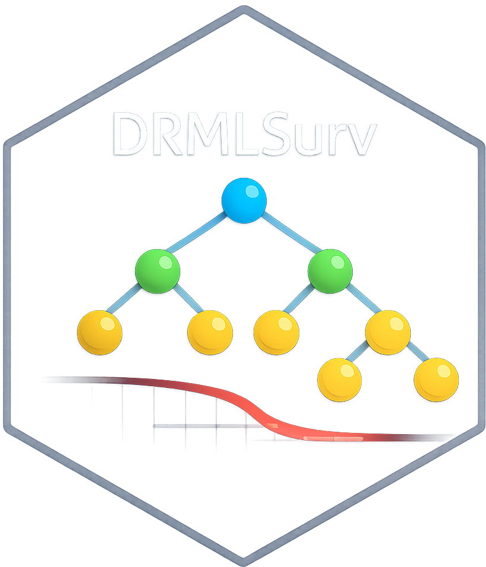

<!-- README.md is generated from README.Rmd. Please edit that file -->

```{r, include = FALSE}
knitr::opts_chunk$set(
  collapse = TRUE,
  comment = "#>",
  fig.path = "man/figures/README-",
  out.width = "100%"
)
```

# DRMLSurv

<!-- badges: start -->
[](https://github.com/EricAnto0/DRMLSurv/actions/workflows/R-CMD-check.yaml)
[](LICENSE.md)
[](https://lifecycle.r-lib.org/articles/stages.html)
[](https://EricAnto0.github.io/DRMLSurv/)
[](https://codecov.io/gh/EricAnto0/DRMLSurv)
[](https://app.codecov.io/gh/EricAnto0/DRMLSurv)
<!-- badges: end -->



DRMLSurv is an R package for two-stage survival analysis with censoring, matching-based imputation, counterfactual outcome construction, and machine-learning estimation of dynamic treatment rules.

Main features include:

- donor-based imputation of censored stage-1 and stage-2 survival times
- matched counterfactual outcome construction under alternative treatment paths
- policy learning with random forests and cross-validation
- policy summary metrics and balance diagnostics

## Installation

```r
# install.packages("remotes")
remotes::install_github("EricAnto0/DRMLSurv")
```

# load package
```r
library(DRMLSurv)
```
